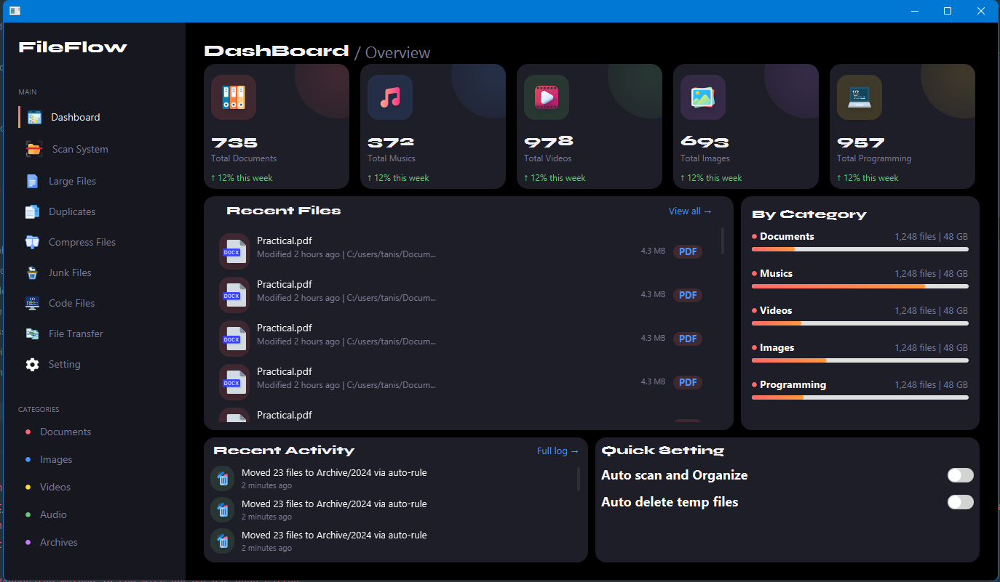
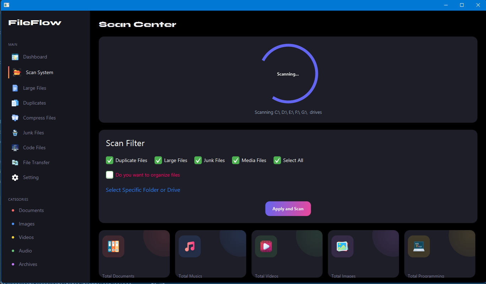
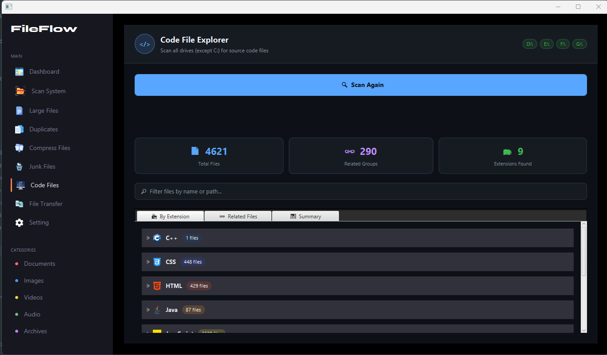
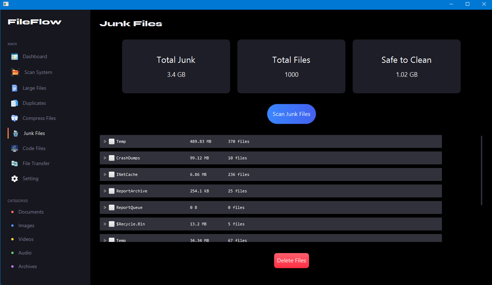
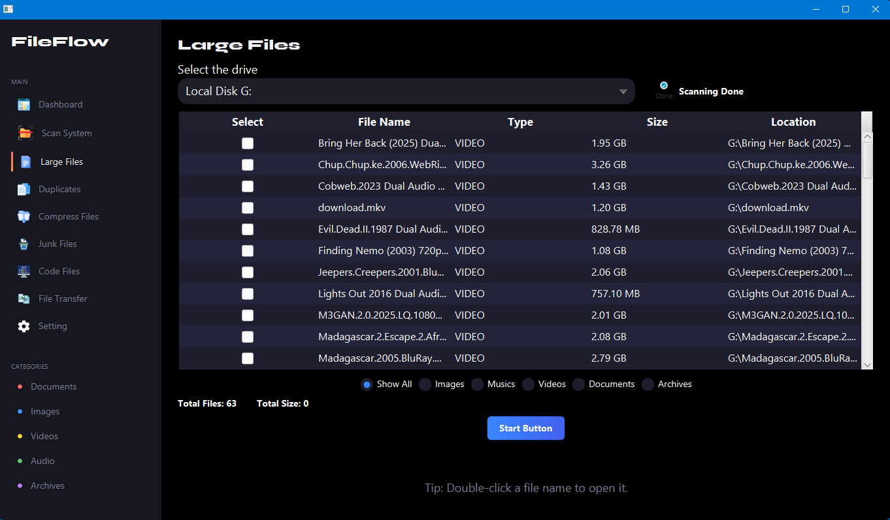

# 🚀 FileFlow - Smart File Management System

<div align="center">

### 📂 Smarter Way to Manage Your Files

A powerful JavaFX-based desktop application that helps users organize, scan, analyze, and optimize their file systems efficiently.


</div>

---

## 📖 Overview

Managing files becomes increasingly difficult as storage grows. Duplicate files, junk files, scattered documents, and large media files often consume valuable disk space and reduce productivity.

**FileFlow** is an intelligent desktop application developed using **Java** and **JavaFX** that automatically scans directories, categorizes files, detects duplicates, identifies junk files, and provides storage insights to help users maintain an organized system.

---

## ✨ Features

### 🔍 Smart File Scanning

* Recursive directory scanning
* Fast file discovery
* Storage analysis

### 📂 Automatic File Organization

* Categorizes files into:

  * Documents
  * Images
  * Videos
  * Audio
  * Archives
  * Programming Files

### 🗑 Junk File Detection

* Detects:

  * Temporary Files (.tmp)
  * Cache Files
  * Log Files
* Helps free up storage space

### 📑 Duplicate File Detection

* Hash-based duplicate detection
* Accurate file comparison
* Eliminates redundant files

### 📦 File Compression

* ZIP compression support
* Reduce storage usage

### 💻 Code File Scanner

* Finds programming-related files:

  * Java
  * Python
  * JavaScript
  * C++
  * PHP
  * And more

### 📊 Storage Analytics

* Category-wise file statistics
* Large file identification
* Storage utilization insights

### 🔄 Background Monitoring

* Monitors selected directories
* Tracks file changes in real time

### 🛡 Safe File Operations

* User confirmations
* Restore/Undo support
* Secure file management

---

## 🏗 Architecture

FileFlow follows the **MVC (Model-View-Controller)** architecture.

```text
User Interface (JavaFX)
          │
          ▼
     Controllers
          │
          ▼
     Service Layer
          │
          ▼
 File System Operations
```

### Main Components

* MainApp
* Dashboard Controller
* Scan Center Controller
* Sidebar Controller
* File Service Module
* Duplicate Finder
* Junk File Finder
* Code File Scanner
* File Organizer

---

## 🛠 Tech Stack

### Backend

* Java 17
* Java NIO
* MessageDigest API
* Watch Service API

### Frontend

* JavaFX
* FXML

### Architecture

* MVC Design Pattern
* Object-Oriented Programming

### Development Tools

* IntelliJ IDEA
* Git
* GitHub

---

## 📸 Application Screenshots

<p align="center">
  
</p>

<p align="center">
  
</p>

<p align="center">
  
</p>

<p align="center">
  
</p>

<p align="center">
  
</p>

## ⚙ Installation

### Clone Repository

```bash
git clone https://github.com/yourusername/FileFlow.git
```

### Open Project

Open using:

* IntelliJ IDEA
* Eclipse

### Run Application

```bash
java --module-path /path/to/javafx/lib --add-modules javafx.controls,javafx.fxml -jar FileFlow.jar
```

---

## 📋 System Requirements

| Component | Requirement             |
| --------- | ----------------------- |
| Processor | Intel i3 or higher      |
| RAM       | 4 GB Minimum            |
| Storage   | 500 MB Free Space       |
| Java      | JDK 17+                 |
| OS        | Windows / Linux / macOS |

---

## 🧪 Testing

✔ Folder Selection

✔ Recursive File Scanning

✔ File Categorization

✔ Duplicate Detection

✔ Junk File Detection

✔ File Compression

✔ UI Integration Testing

✔ System Testing

---

## 🚀 Future Enhancements

* ☁ Cloud Storage Integration
* 🤖 AI-Based File Categorization
* ⚡ Multi-threaded Processing
* 🌐 Web Version
* 📱 Mobile Application
* 📊 Advanced Analytics Dashboard
* 👥 Multi-user Support

---

## 🎓 Academic Project

Bachelor of Computer Application (BCA)

Delhi Skill and Entrepreneurship University

Project Title:

**FileFlow: Smarter Way to Manage Your Files**

---

## 👨‍💻 Author

### Tanishq

* Java Full Stack Developer
* Web Developer
* BCA Student

GitHub: https://github.com/Tanishq242

---

## ⭐ Support

If you like this project, consider giving it a ⭐ on GitHub.

It motivates me to build more projects and contribute to open-source development.
